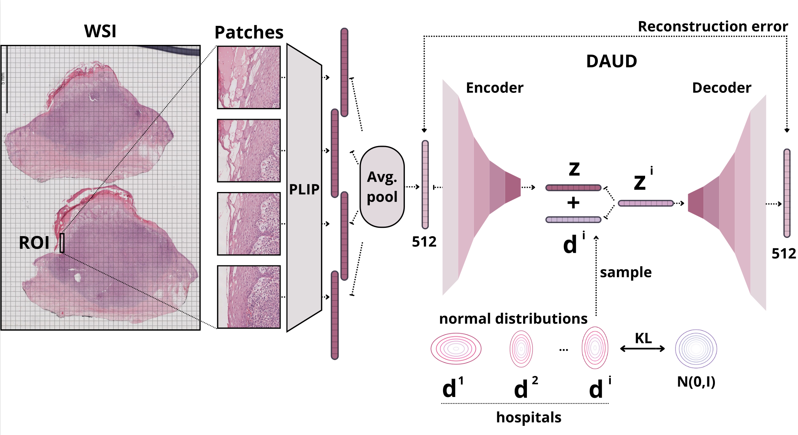

# Domain Adaptation for Unsupervised Cancer Detection (DAUD): An application for skin Whole Slides Images from an interhospital dataset

### Code associated to the paper accepted at  [27th INTERNATIONAL CONFERENCE ON MEDICAL IMAGE COMPUTING AND COMPUTER ASSISTED INTERVENTION](https://conferences.miccai.org/2024/)

#### Citation
~~~
@article{
}
~~~

## Abstract
 Skin cancer diagnosis relies on assessing the histopathological appearance of skin cells and the patterns of epithelial skin tissue architecture. Despite recent advancements in deep learning for automating skin cancer detection, two main challenges persist for their clinical deployment. (1) Deep learning models only recognize the classes trained on, giving arbitrary predictions for rare or unknown diseases. (2) The generalization across healthcare institutions, as variations arising from diverse scanners and staining procedures, increase the task complexity.
We propose a novel Domain Adaptation method for Unsupervised cancer Detection (DAUD) using whole slide images to address these concerns. Our method consists of an autoencoder-based model with stochastic latent variables that reflect each institution's features. 
We have validated DAUD in a real-world dataset from two different hospitals. In addition, we utilized an external dataset to evaluate the capability for out-of-distribution detection. DAUD demonstrates comparable or superior performance to the state-of-the-art methods for anomaly detection. 

 ## Description of the repo
 This repo contains the code used for the paper. 

The tree directory:

- [utils.py](utils.py): Auxiliary functions
- [data.py](data.py): Classes and functions to load the data.
- [eval.py](eval.py): It contains the functions to evaluate the model.
- [train.py](train.py): Functions to train the model.
- [models.py](models.py): Architecture and other models used in the study.
- [run_performance.py](run_performance.py): Main script for running the SOTA comparison.
- [run_ablation.py](run_ablation_study.py): Main script for running the ablation study.
- [run_ood.py](run_ood.py): Main script for running the OoD experiment.

### Dependencies

For this experiment you must install the environment provided in [daud-env.yml](daud-env.yml).
~~~
$ conda env create --name daud --file daud-env.yml
$ conda activate daud
~~~

